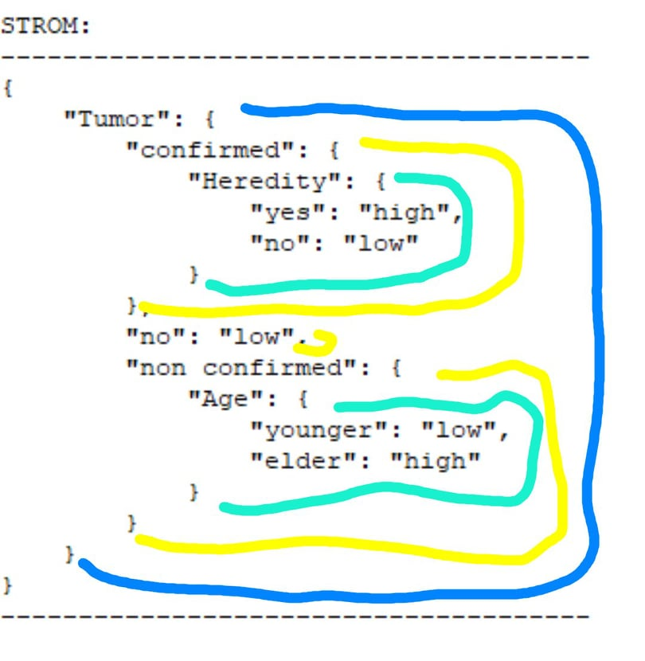

\
Pomôcka na predmet: databázy a získavanie znalostí na Fakulte riadenia a informatiky v Žiline

**Hlavné info:**\
Testovacie súbory sú v `files` 

**Funkcie:** 
1. **Hierarchické zhlukovanie** - občas to dá výsledok na ktorý hovoril že nie je dobre ¯\_(o_o)_/¯
2. **K-means** - 100% dobre
3. **Bayes** - ide lingvisticky aj nelingvisticky 100% dobre
4. **K-cestný rozhodovací strom** - asi takto, treba sa v tom trochu zorientovať, čísla treba rozlúštiť z výpisu  
    
5. **Tree Pruning** - TO DO   

**Poznámky:**\
`File_Manager.py` - chce to xlrd==1.2.0, pri novších verziách nefunguje a bol som príliš lenivý to prerábať \
`Bayes.py ` - Keď som to programoval, iba ja a Allah sme vedeli ako to funguje... teraz to vie už iba on ¯\_(o_o)_/¯ \
`Tree_Prunnig.py` - Nie je to hotové, takže ak sa nudíš smelo do toho... 
